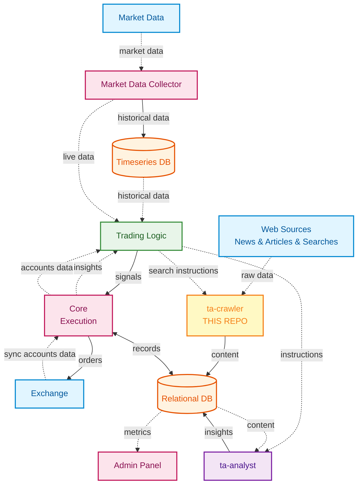

```mermaid
graph TB
    %% External entities
    Web[Web Sources<br/>News & Articles & Searches]:::external
    Data[Market Data]:::external
    Exchange[Exchange]:::external
    
    %% Core modules
    Crawler[ta-crawler<br/>THIS REPO]:::crawler
    Analyst[ta-analyst]:::analyst
    Strategy[Trading Logic]:::strategy
    
    %% Supporting modules
    DataSync[Market Data Collector]:::support
    Core[Core<br/>Execution]:::support
    Admin[Admin Panel]:::support
    
    %% Databases
    DB1[(Relational DB)]:::database
    DB2[(Timeseries DB)]:::database
    
    %% Data flow
    Strategy -.->|instructions| Analyst
    Web -.->|raw data| Crawler
    Strategy -.->|search instructions| Crawler
    Crawler -->|content| DB1
    DB1 -.->|content| Analyst
    Analyst -->|insights| DB1
    
    Data -.->|market data| DataSync
    DataSync -->|historical data| DB2
    
    Core -.->|insights| Strategy
    DB2 -.->|historical data| Strategy
    DataSync -.->|live data| Strategy
    
    Strategy -->|signals| Core
    Core -.-> |accounts data| Strategy
    Core <-->|records| DB1
    Core -->|orders| Exchange
    Exchange -.->|sync accounts data| Core
    
    DB1 -.->|metrics| Admin
    
    %% Styling
    classDef external fill:#e1f5ff,stroke:#0288d1,stroke-width:2px,color:#01579b
    classDef crawler fill:#fff9c4,stroke:#f57f17,stroke-width:2px,color:#f57f17
    classDef analyst fill:#f3e5f5,stroke:#7b1fa2,stroke-width:2px,color:#4a148c
    classDef strategy fill:#e8f5e9,stroke:#388e3c,stroke-width:2px,color:#1b5e20
    classDef support fill:#fce4ec,stroke:#c2185b,stroke-width:2px,color:#880e4f
    classDef database fill:#fff3e0,stroke:#e65100,stroke-width:2px,color:#e65100
```
